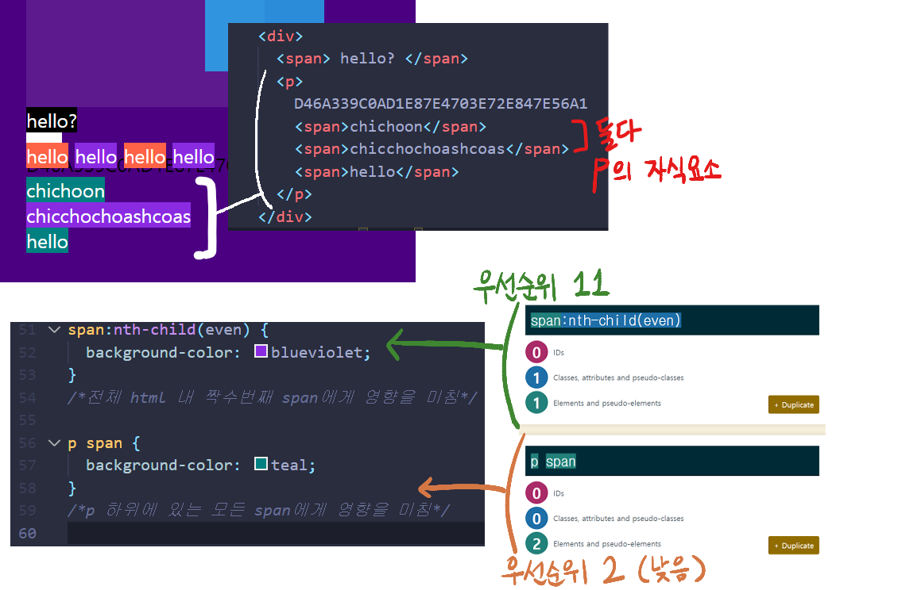

# 3월 8일 (월요일) HTML/CSS/JS 07

## Position

- 레이아웃보다는, 요소를 조금 움직이고 싶을 때 사용
- **position: fixed;**
  - 화면을 스크롤해도 그 자리에 계속 남아있음
  - 처음 화면이 initialize되었을 때 위치한 그 자리에 남아있음
    - 해당 속성은 요소를 다른 레이어로 넘기기 때문에, top 속성이나 bottom 속성 등을 이용해서 요소를 화면상 다른 곳으로 이동시키면 기존에 있던 요소와 겹쳐 보이는 것을 확인할 수 있다
  - 상단 메뉴바 등을 만들 때 유용하게 쓸 수 있다
- **position: static;**
  - 레이아웃이 박스를 처음 위치하는 곳에 두는 것
  - 설정을 해두지 않았을 때의 default 값임
- **position: relative;**
  - 현재 위치를 기준 (0, 0, 0, 0) 으로 원하는 위치에 요소를 옮기고 싶을 때 사용
  - top 속성이 양수이면 아래로, 음수이면 위로
  - bottom 속성이 양수이면 위로, 음수이면 아래로
  - left 속성이 양수이면 오른쪽으로, 음수이면 왼쪽으로
  - right 속성이 양수이면 왼쪽으로, 음수이면 오른쪽으로 해당 픽셀만큼 이동
- **position: absolute;**
  - 부모 요소의 크기를 기준으로 원하는 위치에 요소를 옮기고 싶을 때 사용
    - 이때 **부모 요소는 position: relative**여야 한다! position: relative인 요소가 없을 경우 부모가 body가 됨
  - top 속성은 부모 요소의 위쪽 경계를 기준으로 함
    - 양수이면 경계 위치에서 조금씩 내려가고, 음수이면 경계에서 올라감
  - bottom 속성은 부모 요소의 아래쪽 경계를 기준으로 함
  - left 속성은 부모 요소의 왼쪽 경계, right 속성은 부모 요소의 오른쪽 경계를 기준으로

## Pseudo Selectors

- css에서 요소를 선택할 때 조금 더 세부적으로 들어가는 방법
  - 태그명, id명, class명으로 찾는 것과 또 다름
- 예를 들면, span 다음에 등장하는 class거나 처음으로 등장하는 class 등의 경우일 때 등 더 세세한 조건을 건다
- **요소:first-child** 는 등장하는 요소 태그 중 첫 번째 태그에 효과 적용
- **요소:last-child**는 등장하는 요소 태그 중 마지막 태그에 효과 적용
- **요소:nth-child(n)** 은 등장하는 요소 태그 중 n번째 태그에 효과 적용
  - n에 **even 또는 2n**을 넣으면 짝수번째 요소에 효과 적용
  - n에 **odd 또는 2n+1**를 넣으면 홀수번째 태그에 효과 적용
  - n에 **특정 등차수열**을 넣으면 해당 번째수마다 효과 적용
- **부모요소 요소** 는 부모요소로 지정한 요소를 가진 요소에게 효과 적용
  - 예: **p span {효과}** 는 p 부모를 가진 span에게 효과를 줌
  - **div p span {효과}** 는 div 부모를 가진 p의 자식 요소인 span에게 효과를 줌
  - 명시한 부모-자식 관계가 존재하지 않을 경우 아무런 일도 안 일어남
  - 바로 아래 자식이 아닌 **자식의 자식 (후손)**이어도 효과가 적용됨
    - 예: div span은 div의 자식 span에도 영향을 주지만, div의 자식 p의 자식인 span에도 영향을 미침
- **부모요소 > 요소** 는 부모 요소의 직속 자녀인 요소에게만 효과 적용
  - **div > span** 은 div의 직속 자녀인 span에게만 효과를 부여하고, div의 자식인 p의 자식 span에겐 영향을 주지 않음
- **요소A + 요소B** 는 요소A 바로 옆에 있는 요소B에게 효과 적용 (한 칸이라도 멀리 떨어져있으면 안됨)
- **요소A ~ 요소B** 는 요소 A 뒤에 있는 모든 요소B에게 효과 적용 (+와 달리 멀리 떨어져있어도 됨)

## 번외 : Selectors 우선순위 문제

- p span이 span:nth-child(even) 보다 아래에 있음에도 cascading을 따르지 않고 span:nth child(even) 의 효과가 p span 효과를 무시하고 적용된다
- 이는 span:nth-child(even) 의 우선순위가 p span보다 높기 때문으로, selector들 끼리는 고유의 우선순위 계산법에 의하여 적용된다 (같은 우선순위일 때만 cascading 적용됨)
- [priority 계산하는 곳](https://specificity.keegan.st/)
