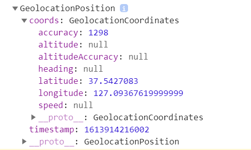

# 2월 20일 (토요일) JS 챌린지 11

## 3.7 Image Background
- **Math.random()** : 0에서 1까지의 랜덤난수를 반환
- **Math.floor()** : 내림 (3.1, 3.5, 3.6 -> 3)
- **Math.ceil()** : 올림 (3.1, 3.5, 3.6 -> 4)

## Getting the Weather part One
- **navigator** object를 이용하면 다양한 api를 이용할 수 있음
- **navigator.geolocation**은 장소 (좌표) 와 관련된 object
    - **getCurrentPosition(함수1, 함수2)** 함수를 이용하여 현재 위치의 좌표를 불러올 수 있다
    - 함수1은 좌표 불러오기에 성공했을 경우 실행됨
    - 함수2는 좌표 불러오기에 실패했을 경우 실행됨
    - 